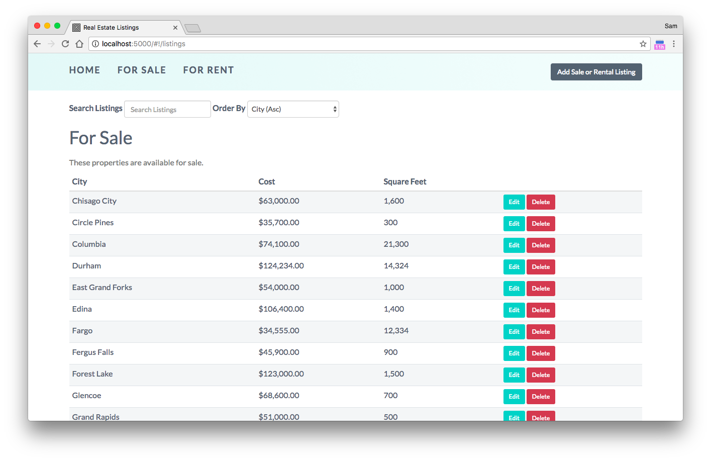

# Weekend Challenge #5 - Real Estate Listings

A Prime Digital Academy challenge for creating a full stack MEAN application that displays of list of real estate listings and giving a user the option to add, delete, or edit listings. 

## Getting Started

These instructions will get you a copy of the project up and running on your local machine for development and testing purposes.

### Installing

Get the app running by first installing the dependencies

```
npm install
```

To run the app running on localhost:5000

```
npm start
```

## Importing the Provided Data File

There is no need to do any initial setup on the database. The following commands will create the **database**, **collections** and **documents** automatically! 

1. Download the r.
2. In Terminal, navigate the `server/data` folder so that you have access to the *listingData.js* and *rentalData.js* files.
3. Run this command in your Terminal: `mongoimport --db realestate --collection rentals --file rentalData.js`
4. Run this command in your Terminal: `mongoimport --db realestate --collection listings --file listingData.js`

## Built With

* [AngularJS](https://angularjs.org/) - The front-end framework used
* [Bootstrap](http://getbootstrap.com/) - CSS Framework
* [Node.js](https://nodejs.org/en/) - Used for server side JavaScript code
* [Express](https://expressjs.com/) - Node.js framework 
* [MongoDB](https://rometools.github.io/rome/) - Database
* [Heroku](https://rometools.github.io/rome/) - Used to deply the project



## Authors

* **Sam Fortin** - [Github](https://github.com/sjfortin)
